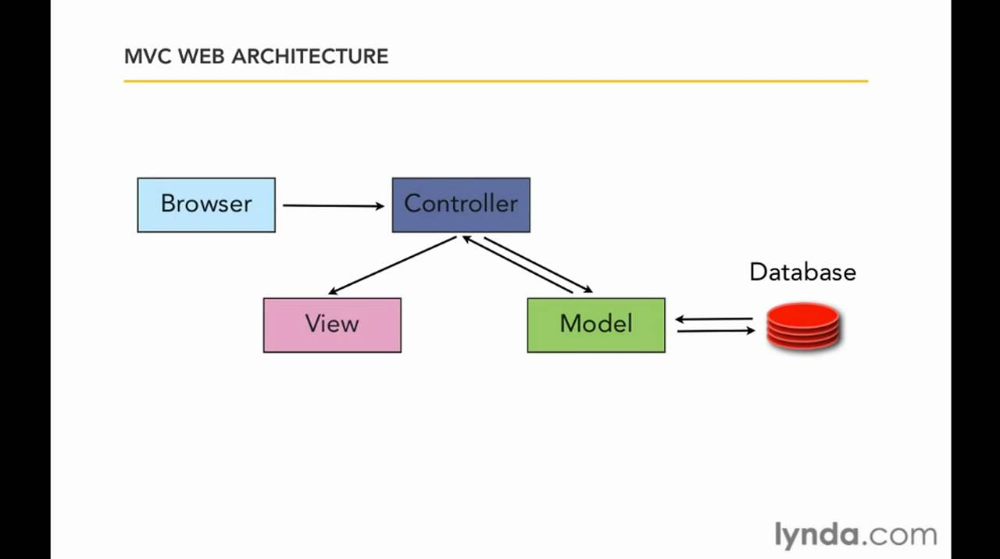
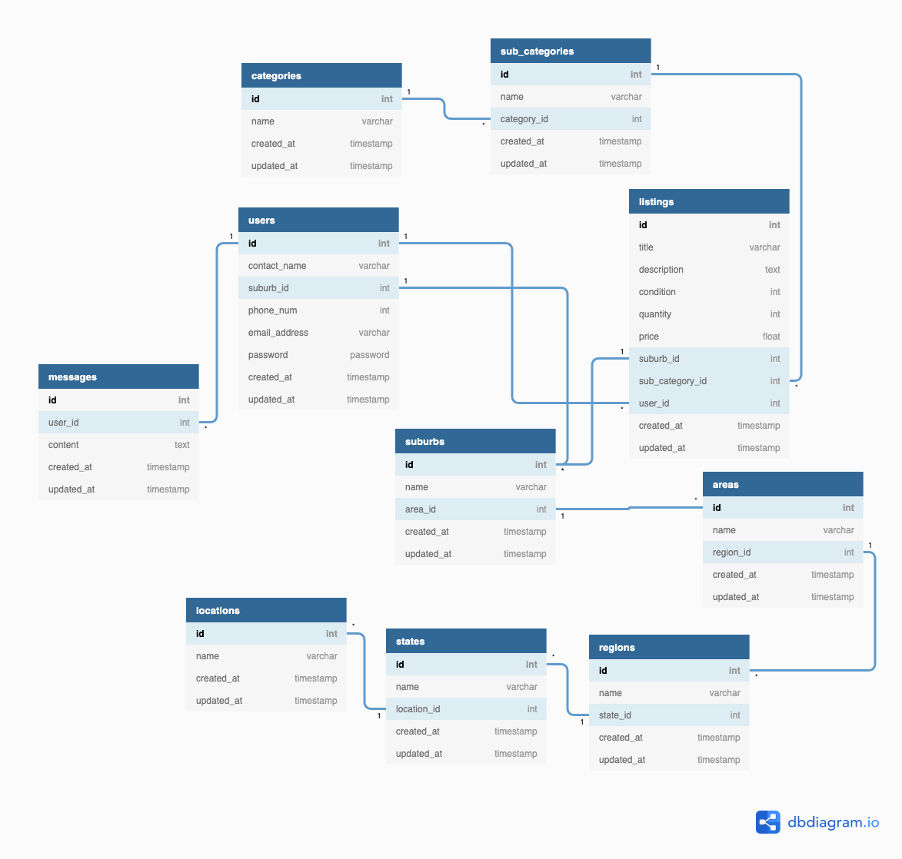

**Author:** [Phil Antiporda](https://github.com/philrussel21)

# Table of Contents

1. [Rails Architecture](https://github.com/philrussel21/t2a1#q1-describe-the-architecture-of-a-typical-rails-application)
1. [PostgreSQL](https://github.com/philrussel21/t2a1#q2-identify-a-database-commonly-used-in-web-applications-including-rails-and-discuss-the-pros-and-cons-of-this-database)
1. [Agile Project Management](https://github.com/philrussel21/t2a1#q3-discuss-the-implementation-of-agile-project-management-methodology)
1. [Source Control Workflow - Forking Workflow](https://github.com/philrussel21/t2a1#q4-provide-an-overview-and-description-of-a-standard-source-control-workflow)
1. [Software Testing Process](https://github.com/philrussel21/t2a1#q4-provide-an-overview-and-description-of-a-standard-software-testing-process)
1. [System Security](https://github.com/philrussel21/t2a1#q6-discuss-and-analyse-requirements-related-to-information-system-security-and-how-they-relate-to-the-project)
1. [Data Integrity](https://github.com/philrussel21/t2a1#q7-discuss-common-methods-of-protecting-information-and-data-and-how-you-would-apply-them-to-the-project)
1. [Legal Obligations](https://github.com/philrussel21/t2a1#q8-research-what-your-legal-obligations-are-in-relation-to-handling-user-data-and-how-they-can-be-met-for-the-project)
1. [Relational Database - Structural](https://github.com/philrussel21/t2a1#q9-describe-the-structural-aspects-of-the-relational-database-model-your-description-should-include-information-about-the-structure-in-which-data-is-stored-and-how-relations-are-represented-in-that-structure)
1. [Relational Database - Integrity](https://github.com/philrussel21/t2a1#q10-describe-the-integrity-aspects-of-the-relational-database-model-your-description-should-include-information-about-the-types-of-data-integrity-and-how-they-can-be-enforced-in-a-relational-database)
1. [Relational Database - Manipulation](https://github.com/philrussel21/t2a1#q11-describe-the-manipulative-aspects-of-the-relational-database-model-your-description-should-include-information-about-the-ways-in-which-data-is-manipulated-added-removed-changed-and-retrieved-in-a-relational-database)
1. [Sorting Algorithms - Quick & Selection Sort](https://github.com/philrussel21/t2a1#q12-identify-and-explain-the-workings-of-two-sorting-algorithms-and-discuss-and-compare-their-performanceefficiency-ie-big-o)
1. [Searching Algorithms - Linear and Binary Search](https://github.com/philrussel21/t2a1#q13-identify-and-explain-the-workings-of-two-search-algorithms-and-discuss-and-compare-their-performanceefficiency-ie-big-o)
1. [Marketplace App - Gumtree](https://github.com/philrussel21/t2a1#q14-conduct-research-into-a-marketplace-website-app-and-answer-the-following-parts)
    - [Software used](https://github.com/philrussel21/t2a1#a-list-and-describe-the-software-used-by-the-app)
    - [Hosting hardware](https://github.com/philrussel21/t2a1#b-describe-the-hardware-used-to-host-the-app)
    - [Tech Interactions](https://github.com/philrussel21/t2a1#c-describe-the-interaction-of-technologies-within-the-app)
    - [Data Structure](https://github.com/philrussel21/t2a1#d-describe-the-way-data-is-structured-within-the-app)
    - [Tracked Entities](https://github.com/philrussel21/t2a1#e-identify-entities-which-must-be-tracked-by-the-app)
    - [Relationships and Associations](https://github.com/philrussel21/t2a1#f-identify-the-relationships-and-associations-between-the-entities-you-have-identified-in-part-e)
    - [ERD schema](https://github.com/philrussel21/t2a1#g-design-a-schema-using-an-entity-relationship-diagram-erd-appropriate-for-the-database-of-this-website-assuming-a-relational-database-model)

# T2A1 - Workbook Term 2

[Link to Repo](https://github.com/philrussel21/t2a1)

## Q1 Describe the architecture of a typical Rails application.

Simply put, Ruby on Rails follows the Model - View - Controller (MVC) pattern. It is an architectural pattern that separates an application into three main logical components: Model, View, and the Controller. Each component is built to handle specific development parts of an application. MVC architecture is one of the most frequently used web development frameworks to create scalable and extensible projects that focus on simultaneous development and code reusability to date.

The Model component contains the pure application data. It corresponds to all the data-related logic that the user works with. In Rails, the model is known as Active Record which is represented by a Ruby class that can add to database records, find particular data the user is looking for, update or remove that found data. These particular actions are almost the core of every application and are almost present in any application. These operations are commonly referred to by the acronym CRUD which stands for Create, Read, Update, and Destroy.

The View component handles the user interface (UI) of the application. It presents the data that it was passed with in a certain way. In Rails, the view is also referred to as Action View. This is where HTML, CSS and Javascript are handled and eventually shown to the user.

The Controller component acts as the connector between the model and the view. The controller handles the decision making aspect of an application. After the router has determined which controller to use for a request, it is the job of the controller to understand the request and provide an appropriate response. A common example would be if a user requests a particular data, the controller would advise the model to fetch the data. Once completed, the controller would then make this data accessible to the view, which is then presented in a certain way. In Rails, the controller is also referred to as Action Controller.

##### Resources

-   [Source 1](https://www.techcareerbooster.com/blog/ruby-on-rails-architecture-overview-for-beginners)
-   [Source 2](https://guides.rubyonrails.org/active_record_basics.html)
-   [Source 3](https://guides.rubyonrails.org/layouts_and_rendering.html)
-   [Source 4](https://guides.rubyonrails.org/action_controller_overview.html)
-   [Image Source](https://www.youtube.com/watch?v=3mQjtk2YDkM)

## Q2 Identify a database commonly used in web applications (including Rails) and discuss the pros and cons of this database.

There are two main types of databases that are commonly used in web applications. These are relational databases that run Structured Query Language (SQL) and non-relational databases that run Not Only Standard Query Language (NoSQL). As for Rails, a relational database is highly regarded because of the way they are structured, with a tabular schema of rows and columns. One of the major databases that are used today is PostgreSQL.

PostgreSQL or is commonly referred to as ‘postgres’, is a free and open-sourced relational database that has its motto “The World’s Most Advanced Open Source Relational Database”. As a relational database, they store and handle data in a structured way using rows and columns. Each row represents a record and columns representing its attributes. This schema makes retrieving data with such ease. Having all the qualities of a relational database, postgres takes it to the next level by being an object-relational database. This essentially means that the tables in the database would include the inheritance feature. Table inheritance is the property that allows a table to inherit and share attributes from its supertable above the table hierarchy. Postgres also features function overloading which allows developers to define two or more functions of the same name with different implementations. Postgres is also less vulnerable to data corruption because it protects data integrity at the transaction level. Extensibility is another feature that postgres offers. Compared to other databases, postgres lets you add additional features to extend and scale the database easily.

Unfortunately, postgres also has its own drawbacks. Being a relational database, it has to follow the strict schema that has been defined. If you wish to add an extra field to a particular data, you cannot do this unless you put an extra field to all the previous entries and records. Being an open-sourced database application means it is not owned by an organization and will not come with a warranty and has no liability or indemnity protection. It’s extensibility, scalability and data integrity features are sometimes traded at the expense of overall speed.

##### Resources

-   [Source 1](https://developer.okta.com/blog/2019/07/19/mysql-vs-postgres)
-   [Source 2](https://www.aalpha.net/blog/pros-and-cons-of-using-postgresql-for-application-development/)

## Q3 Discuss the implementation of Agile project management methodology

Agile project management is a constant and repetitive approach to managing software development projects that targets consecutive releases and integrating customer feedback with every iteration. Embracing agile project management methodologies will guarantee software teams to increase their development efficiency, improve and expand team collaboration, and flexibility to adapt and respond to industry market trends. Agile project management is usually broken down into two categories: the Scrum framework and the Kanban framework.

The scrum framework is an implementation of agile project management that uses predetermined iterations of work called sprints. These sprints consist of planning, building, testing, reviewing then arriving with a potentially shippable product within a timeframe. Each scrum has four ceremonies that bring structure to sprint, namely:

-   **Sprint Planning**
    -   Sprint planning is to determine the goal in the coming sprint.
-   **Sprint Demo**
    -   Sprint demo is a sharing meeting to demo what they’ve completed in that sprint.
-   **Daily Standup**
    -   Daily stand up is a mini meeting everyday to discuss status and roadblocks among the team.
-   **Retrospective**
    -   Retrospective is a review or reflection of actions to improve the next sprint.

There are also 3 roles in the scrum. The **product owner**, **scrum master**, and the **scrum team**.

-   The product owner is responsible for defining the features of a needed product.
-   The scrum team consists of developers, writers, testers and anyone else that helps to build the product, and
-   The scrum master is the servant-leader for the scrum team that is responsible for promoting and supporting scrum by helping everyone understand scrum theories, practices, rules and values.

Scrum starts with the backlog, or body of work that needs to be done. Backlogs are also categorized into two: product backlog and the sprint backlog. Product backlog is owned by the product owner in which they create a prioritized list of features known as user stories that could go into the product. User stories are a way to describe a feature set that follows the “As a user, I need something, so that reason.” format. This format gives the team the right amount of time it would need to complete the task. These user stories are then put into the sprint backlog until the capacity is reached.

Kanban on the other hand, has no backlogs. Instead, it has a To Do column. Kanban focuses on matching the work to the team’s capacity and getting things done as fast as possible giving flexibility and adaptability to changes. The amount of work is in line with the team’s capacity through WIP limits. WIP limits is a set limit of work that can be in a single column at a time, with the exception of the To Do column.

##### [Resource](https://www.atlassian.com/agile/project-management)

## Q4 Provide an overview and description of a standard source control workflow

Source control, or commonly referred to as version control, is the process of tracking and managing the history and changes of the code. It also allows you to go back in time to view your source code at various points of a codebase’s history. Source control systems also make collaborations between teams of developers a lot easier by allowing them to work simultaneously on the same source file and the ability to resolve code conflicts.

Git is a free and open-source distributed source control system that embodies all these characteristics. With its power and flexibility, it is only reasonable to follow recommendations on how to accomplish work in an effective and efficient manner, hence Git Workflows. The Forking Workflow is one of the many Git workflows and is common to open-source projects.

### Overview of Forking Workflow

1. The project maintainer creates a public repository stored on a server.
1. New developers stumble upon this project and were interested in contributing to this project. Instead of directly cloning the project directly to their local machine, they fork the official repository to create a copy of it on the server, under their account.
1. Once the project is forked, they then clone a copy of it to their local machine, from their account.
1. In addition to their repository (conventionally called origin), a remote path for the open-sourced project (conventionally called upstream) is added to the local clone.
1. Create a new branch for the desired or assigned feature changes to be made.
1. Commit changes to this branch.
1. The updated branch gets pushed to their repository (origin remote path).
1. Go to the remote repository server and open a pull request from the new branch to the open-sourced project’s (upstream) repository.
1. If approved by the project maintainer, the branch would be merged into the open-source project’s repository.

##### Resources

-   [Source 1](https://www.atlassian.com/git/tutorials/comparing-workflows/forking-workflow)
-   [Source 2](https://aws.amazon.com/devops/source-control/)

## Q5 Provide an overview and description of a standard software testing process

Testing is a series of actions to assess a system, a software, or its components with the aim to figure out if it passes specific requirements or not. It is done to locate any errors, gaps, or missing components in contrast to the actual requirements. Testing intends to find these errors in the testing stage and tries to fix these gaps to arrive at a product free of bugs. As the saying goes, “Software is never finished” so does testing. Adding new features to the product also means another stage of testing which are both necessary to count as an improvement.

Software testing processes vary from company to company and from person to person but overall, they all share these basic principles.

1. **Planning**
    - The scope of the test is discussed and the risks associated are evaluated including the range and duration of the testing.
1. **Creation of Scenarios**
    - The stage where the “expected” outputs are laid out in accordance to the nature of the project to be tested. This stage should consider both distinct and plain outputs.
1. **Preparation of Test Environment and Data Creation**
    - This stage is the last step before the actual tests. Importing and installing the product to be tested in the test environment, setting up data required for the test, checking the actual test environment for the best course and all other necessary preparations are made before starting the test.
1. **Running the Scenarios**
    - The stage where the tests are actually ran. The test cases and scenarios that have been put in place are applied.
1. **Results reporting**
    - The stage where the results of the test scenarios are communicated to the appropriate personnel. This can be done by creating a concise report that may include media (photos and/or videos) to highlight errors.

#####

[Resource](https://medium.com/swlh/software-testing-process-and-levels-of-testing-4274904ce655)

## Q6 Discuss and analyse requirements related to information system security and how they relate to the project.

As an online marketplace, the app is designed to connect sellers and consumers in the biggest platform available to date, the world wide web. This gives consumers a wide variety of choices and promotes competition in the market. Sellers have absolute lower setup costs compared to a more traditional demographic constraint retail store and have the ability to address a bigger pool of customers. Aside from attracting a wide variety of sellers and consumers, choosing the world wide web as its platform comes with a threat: attracting cyber attacks.

There are many ways in which a system can be compromised and breached. Common types of these threats are infectious worms, port scanning, and the infamous denial of service (DOS) attack. To protect against these threats, security measures are to be followed at the following levels.

-   **Physical**

    -   The physical location of the computer systems must be secured and protected against malicious intruders. To prevent this risk, relocating to a web server may be considered, but be warned as web servers have security risks of its own. Consideration of hosting an actual server or web server would generally depend on the size of the marketplace app as they both carry associated security risk.

-   **Human**

    -   Sellers and consumers must be signed in, and if a new user, have the ability to sign up. This feature alone could limit the access of unauthorized personnel from accessing information that does not apply to them, thus separation of concerns between sellers and consumers. A special user admin can be set up to both have access as seller and consumer to handle user issues.

-   **Operating System**

    -   The system must have little to no security flaws, thus thorough testings are to be put in place during development to address flaws and to arrive at a product that is free of bugs. A convention should also be stated and followed specifically to sellers when uploading files (photos) of their product to avoid accidentally or intentionally overwriting important files.

-   **Networking System**
    -   Information shared between different systems must be air-tight secured via a network. Security tokens only recognized by our app being passed along would serve as a protection against malicious eyes.

With technology evolving at a rapid phase, so does security and its threats, but with these extra steps and continuous maintenance, we continue to arrive at system integrity; system free of unauthorized users.

##### [Resource](https://www.geeksforgeeks.org/system-security/)

## Q7 Discuss common methods of protecting information and data and how you would apply them to the project.

It is our duty of care to secure the product from malicious attackers from accessing our user data. Fortunately, we have multiple ways of protecting our users from these risks. For starters, the proper use of HTTP protocol would be put in place as a first layer of security and the requirement of security tokens that are only recognized by our app would ensure the secure flow of information and protect from cross-site request forgery (CSRF) attack, among other things.

Authentication of users by setting up sign in and sign up features allows appropriate personnel the right amount of access. User passwords for this account sign ins should also be encrypted to increase security and to repel malicious eyes as an extra measure.
Two-factor authentication would also be put in place with a trusted third party email application to improve security. Users are to be asked to sign in to validate credentials before finalizing a purchase, as well as putting a product on the market. This would secure the sensitive information that is to be filled in a form (e.g. checkout form).

When a decision has been made to use a relational database, the app should also be protected from an SQL-injection attack, an attack where hackers are able to run their code to our systems. The application can be protected from this attack by running checks on each user input and by adhering to conventions put in place by database creators. Protecting from this attack would ensure the integrity of user data in our database.

These methods were chosen with the highest probability of data security that would eliminate or minimise potential threats to a marketplace web application.

##### [Resource](https://guides.rubyonrails.org/security.html)

## Q8 Research what your legal obligations are in relation to handling user data and how they can be met for the project

Australia regulates privacy and protection of user data through a combination of federal, state and territory laws. The federal Privacy Act of 1988 (Privacy Act) was implemented to improve and secure the privacy of individuals on how their data are handled by organisations with annual turnover of more than \$3 million and some other organisations, as well as all Australian Government Agencies. With the huge potential of this marketplace app to hit the benchmark, it is our responsibility to adhere to these legal obligations. The 13 Australian Privacy Principles (APPs) are the foundation of the Privacy Act. The following is how APPs govern standards, rights, and obligations and their application into our marketplace app:

-   **The collection, use and disclosure of personal information**
    -   The marketplace app would adhere to this principle by explicitly stating when they would collect user information, how it would be used and managed throughout the application in the Privacy Policy page and would also be mentioned under the Terms of Conditions when signing up. This would promote openness and transparency in handling user data.
-   **An organisation or agency’s governance and accountability**
    -   The marketplace app would protect and secure personal information it holds from exploitation, loss and unauthorised access and modification by taking reasonable steps such as securing the flow of information along the network and continuous maintenance and update of security faculties that have been put in place.
-   **Integrity and correction of personal information**
    -   Allowing users to update their personal information to remove inaccurate, out of date, incomplete, irrelevant and misleading information about them provided security checks have been cleared. A good example would be a change in email address. The user would need to be logged in before making such changes.
-   **The rights of individuals to access their personal information**
    -   Users would be given a feature to view their account information which include name, email, password, and address among other things. They would also be able to update this information. These options would only be available once security checks have been passed (log in).

##### [Resource](https://www.oaic.gov.au/privacy/australian-privacy-principles/)

## Q9 Describe the structural aspects of the relational database model. Your description should include information about the structure in which data is stored and how relations are represented in that structure.

When we say relational databases, it refers to the collection of relationships of the records in the database in the form of tables. They store and maintain access to data points that are related to each other. This relationship is established by having each row hold a record with a key(unique ID). Attributes of the data are used as columns and each record usually has a value for each attribute.

Relational databases also have predefined schema. This means that when designing a database table, the columns within the table will control the allowed data types and data ranges that the table accepts which would require time and resources for preparation. However, it is important to note that when a table is properly designed, storing and retrieving data from the table would be easier and a lot faster.

In terms of scalability, relational databases were designed to run on a single server to maintain data integrity so scaling would be challenging and disruptive, but would be rewarding. This would involve an increase in CPU, RAM, or SSD to scale the database.

##### Resources

-   [Source 1](https://www.oracle.com/au/database/what-is-a-relational-database/)
-   [Source 2](https://www.thorntech.com/2019/03/sql-vs-nosql/)

## Q10 Describe the integrity aspects of the relational database model. Your description should include information about the types of data integrity and how they can be enforced in a relational database.

Data Integrity is defined as the overall completeness, accuracy and consistency of data.
The strength of the integrity of data would determine how safe your data would be from malicious threats. Securing this would mean the information stored in a database will always be complete, accurate, and reliable no matter how often it is queried or how long it is stored. They can be divided into two types: Physical and Logical Integrities. Physical is the substantial nature of the database which can be compromised by natural disasters, power outages and intruders. Logical on the other hand is the protective shield that protects data from human errors and hackers.

The way relationships are structured in a relational database means it follows predefined integrity rules to ensure accuracy and accessibility of its data. It will not commit for one part until it knows the rest of the actions will not be committed. This various commitment capability is referred to as atomicity. Atomicity is one of the four components of a database that ensures a transaction is complete in a timely manner. The other component is Consistency. This component ensures the data must be valid and follows predefined integrity rules. Isolation is applied when transactions are run at the same time, making sure they are being run methodically instead of contradiction. And lastly, even in the event of a system failure, once a query has been committed, it is considered permanent making it Durable. Together, these 4 components make up ACID compliance. They handle the integrity of your data by defining what a query should consist of and how it interacts with the database, ensuring database tables are always on the same page.

##### Resources

-   [Source 1](https://www.talend.com/resources/what-is-data-integrity/)
-   [Source 2](https://www.oracle.com/au/database/what-is-a-relational-database/)
-   [Source 3](https://www.thorntech.com/2019/03/sql-vs-nosql/)

## Q11 Describe the manipulative aspects of the relational database model. Your description should include information about the ways in which data is manipulated (added, removed, changed, and retrieved) in a relational database.

Querying is the process of requesting data or information from a database table. Querying data from a relational database is done using Structured Query Language (SQL). Using SQL, developers would be allowed to communicate with the database. This language is very lightweight and declarative, almost as if writing in plain English. This quality makes it easier for less technical staff to learn and query. Relational database, being structured and organized in nature makes it efficient to retrieve and update data quickly. The following are the basic actions on how SQL manipulates data in a relational database. Table_name represents the name of the table that has been set up.

-   `INSERT INTO table_name (column1, column2, columnN);`
-   `VALUES (value1, value2, valueN);`
    **or**
-   `INSERT INTO table_name VALUES (value1, value2, valueN);`

    -   These statements are used to add new rows of data to a relational database. Column1 thru columnN represents the columns in the table and value1 thru valueN its values. It is important to point out that the order of the values should be the same order as the columns in the table. The one-liner syntax can be used if you wish to add values for all the columns of the table.

-   `DELETE FROM table_name;`
-   `WHERE column = value;`

    -   The syntax above is followed to remove a record from the database. The `WHERE` keyword is followed by the condition you want to match to find the right record, represented by a column and its value. If you wish to delete all the records from the table, you can omit the `WHERE` keyword and this would clear the table.

-   `UPDATE table_name;`
-   `SET column = value;`
-   `WHERE column = value;`

    -   The statements above are used to modify and update the existing data in the table. It would look for the record with matching condition next to the `WHERE` keyword inside the `table_name`. Once found, it will update its column values with the values passed next to the `SET` keyword. Omitting the `WHERE` keyword would affect all the rows instead of a particular record.

-   `SELECT column1, column2, columnN;`
-   `FROM table_name;`
-   `WHERE column = value;`
    -   `SELECT` statement is used to retrieve all the column data from the table next to the `FROM` keyword. It’s specificity is increased with the use of the `WHERE` keyword when a column value is passed. This combination would yield a particular data. Alternatively, if you wish to retrieve all data from all the fields available, the syntax `SELECT * FROM table_name;` can be used.

##### Resources

-   [Source 1](https://www.tutorialspoint.com/sql/sql-select-query.htm)
-   [Source 2](https://www.tutorialspoint.com/sql/sql-where-clause.htm)
-   [Source 3](https://www.tutorialspoint.com/sql/sql-update-query.htm)
-   [Source 4](https://www.tutorialspoint.com/sql/sql-delete-query.htm)

## Q12 Identify and explain the workings of TWO sorting algorithms and discuss and compare their performance/efficiency (i.e. Big O)

Sorting algorithms, as the name suggests, are algorithms used to rearrange a given set or array of elements in a certain order in accordance to the defined comparison operator. There are more than 10 sorting algorithms and two of them are the Quicksort Algorithm and the Selection Algorithm.

Quicksort algorithm or also known as partition-exchange sort, is an algorithm that follows a divide-and-conquer analogy. It is implemented by selecting a ‘pivot’ element from the array and partitioning the other elements into two sub-arrays having all the elements less than the ‘pivot’ element to its left and greater than elements to its right all the while finding the correct index for the ‘pivot’ element. There are many ways to partition elements into two sub-arrays. One way is to set two variable counters.

### Quick Sort

Given an unsorted array, we assign the ‘pivot’ element as the last value. Pivot element can either be the first, the last, the median or a random element but by convention, it should be the last element. We then set two variable counters ‘i’ and ‘j’. The variable ‘i’ would have the index of the first element less than 1 and the ‘j’ variable is initially the index of the first element of the array. The value of the element in index ‘j’ would be compared to the ‘pivot’ element. If the value of the element in index ‘j’ is greater than the ‘pivot’ element, we increment ‘j’ to move on to the next element of the array, otherwise, increment ‘i’ and then swap the values of the elements in ‘i’ and ‘j’ indices then increment ‘j’ to move on to the next element. Repeat the process until we reach the element before the ‘pivot’ element. After the last comparison, we then move the ‘pivot’ to its rightful index by incrementing ‘i’ one more time before swapping the values of index i with the pivot. This action would partition the array into two sub-arrays. The left side of the pivot element would all be less than the pivot element and the greater than on the right side. Apply the same process on the sub-arrays recursively and we would eventually end up with a sorted array.

The time taken by QuickSort depends on the number of inputs. On average, the time it takes is O(log n). In a worst case scenario, this algorithm would take O(n^2) time when the smallest or the greatest element is picked as the pivot element, which usually occurs when the array is already sorted in increasing or decreasing order. On the other hand, its best day is when the partition process picks the middle element as pivot recursively thus resulting in O(log n) time. Overall, its average timing is what makes it one of the fastest sorting algorithms today.

In selection sort, the main idea of the algorithm is to maintain two subarrays in a given array, one sorted and one unsorted then finds the smallest unsorted element and adds it to the end of the sorted array.

### Selection Sort

Initially, all the elements in the array would be the unsorted part of the array. The algorithm would search for the smallest value in the unsorted array. Once found, it would then swap the value with the first element of the unsorted part of the array, making it the first element and thus becoming the sorted part of the array while also reducing the number of the unsorted part of the array. After that, the algorithm would then again look for the smallest value in the unsorted part of the array and once found, it would again swap positions with the first element of the unsorted part of the array, essentially putting it at the end of the sorted array. This process is repeated until no element is left at the unsorted part of the array.

Looking closely, the algorithm consists of two nested loops. The first being looping through every element in the array, swapping if applicable, and the second being looping through every element in the unsorted part of the array, looking for the smallest value. This would mean that the time selection sort takes would be O(n^2) both in its worst and best case scenarios.

When comparing algorithms according to their time complexity, Big O notations serve as the measurement by describing the behaviour of the algorithm when given a particular value or to infinity. The more complex the behaviour, the more time it would take. Comparing the two sorting algorithms listed above, we can say that in its best scenario, QuickSort’s O(log n) performs faster than Selection Sort’s O(n^2).

##### Resources

-   [Source](https://www.geeksforgeeks.org/sorting-algorithms/)
-   **Quick Sort**
    -   [Source 1](https://www.geeksforgeeks.org/quick-sort/)
    -   [Source 2](https://www.youtube.com/watch?v=MZaf_9IZCrc)
-   **Selection Sort**
    -   [Source](https://www.geeksforgeeks.org/selection-sort/)
    -   [Image Source](https://www.google.com/url?sa=i&url=https%3A%2F%2Fwww.hackerearth.com%2Fpractice%2Falgorithms%2Fsorting%2Fselection-sort%2Ftutorial%2F&psig=AOvVaw2QIxv_-hgI32XBFV9C2DBY&ust=1594993460764000&source=images&cd=vfe&ved=0CAIQjRxqFwoTCPjzjOfz0eoCFQAAAAAdAAAAABAD)

## Q13 Identify and explain the workings of TWO search algorithms and discuss and compare their performance/efficiency (i.e. Big O)

Searching algorithms, as the name suggests, are algorithms that find or retrieve an element from any data structure. There are more than 10 search algorithms available for use, with distinct speed and memory usage compared to another. According to its search operation, they are generally classified into two categories. Sequential Search and Interval Search. The former being every element in the list or array is being checked sequentially against the value being searched. A great example of this category is the Linear Search. The latter, on the other hand, are designed for searching in a sorted data structure. They are generally more efficient compared to sequential searching as they target the center of the search structure and divide the scope of the search in half recursively. Binary Search is the perfect example of this category.

Linear search is a method for finding an element within a list by sequentially checking each element of the list or array until a match is found or when the whole list or array has been searched. The idea of this algorithm is to iterate across the array from left to right, searching for a specified element.

### Linear Search

Given an element x, finding x using the linear search starts off from the leftmost element of an array or list, which is usually at index 0. One by one, each element of the array or list is compared to x. If an element matches with x, the index of that element is returned. If each element in the array or list has been checked and compared and no match was found, return -1.

The steps are pretty simple enough yet practically, linear search is rarely used because of its slow speed. Since it has to do the checks with every element, if a large array was given and the value is at the end of the array, this would consume a huge amount of time. Also, if the value is not in the array, the checks on every element would still be done until the end of the array thus also resulting in consuming a huge amount of time. Generally, as the size of the array or list increases, the amount of time it would take to accomplish its task would be greatly affected thus resulting in a linear time complexity or O(n).

On the other hand, Binary search is a method for finding an element in a sorted list or array by divide and conquer analogy. Dividing the list or array would reduce the search area by half each time, trying to find a target number. This algorithm is faster than linear search but heavily relies on the list or array being sorted, otherwise assumptions that the value is not on the other half of the array’s contents cannot be made. With constant dividing and reducing, if the value is not present in the sorted list or array, this would result in the size of the array being 0.

### Binary Search

Given a sorted array, finding x in the array using the binary search would start by calculating the middle point of the current array. If the middle value is x, return. If x is less than the value of the middle point, repeat the process on the left side of the middle point and discard the rest thus creating a sub array. However, if x is greater than the value of the middle point, repeat the process on the right side of the middle point and discard the rest to create a sub array. Repeat the process of sub creating arrays and discarding the rest until the size of the sub array is 0, which essentially means x is not in the array, or when x becomes the middle value.

With the nature of binary search’s divide and conquer analogy, this algorithm is considered to be one of the fastest search algorithms to date, granted the given list or array is sorted. Constant reduction of the search area by half results to the logarithmic time complexity or O(log n) which essentially means it's more efficient and less complex compared to Linear search’s O(n).

##### Resources

-   [Source](https://www.geeksforgeeks.org/searching-algorithms/)
-   **Linear Search**
    -   [Source 1](https://www.geeksforgeeks.org/linear-search/)
    -   [Source 2](https://www.tutorialspoint.com/data_structures_algorithms/linear_search_algorithm.htm)
-   **Binary Search**
    -   [Source 1](https://www.geeksforgeeks.org/binary-search/)
    -   [Source 2](https://www.tutorialspoint.com/data_structures_algorithms/binary_search_algorithm.htm)

## Q14 Conduct research into a marketplace website (app) and answer the following parts:

Web app of choice: [**Gumtree**](https://www.gumtree.com.au/)

### a. List and describe the software used by the app.

The software used by the marketplace Gumtree are as follows:

-   **Java**
    -   A powerful general-purpose programming language that is being used to develop desktop and mobile applications as well as big data processing, embedded systems and many more. It is currently being run on 3 billion devices worldwide making it one of the most popular programming languages. [Source](https://www.programiz.com/java-programming)
-   **Nginx**
    -   Nginx (pronounced as “engine x”) is an HTTP and reverse proxy web server, and a TCP/UDP proxy server which can also be used as a load balancer, mail proxy and an HTTP cache. [Source](https://nginx.org/en/)
-   **React**
    -   React is an open-source JavasScript library that is used to make interactive User Interface (UI) easier. [Source](https://reactjs.org/)
-   **jQuery**
    -   jQuery is a free, open-source, and lightweight JavaScript library to simplify HTML DOM tree manipulation, event handling, CSS and their animations, utilities and AJAX. [Source](https://www.w3schools.com/jquery/jquery_intro.asp)
-   **jQuery UI**
    -   A collection of graphical user interfaces (GUIs) for interactions, effects, widgets and themes implemented with jQuery JavaScript library. [Source](https://jqueryui.com/)
-   **Select2**
    -   A jQuery based replacement for select boxes by offering customizable select boxes for tagging, searching, remote data sets, infinite scrolling and many more. [Source](https://select2.org/)
-   **Modernizr**
    -   A JavaScript library that consists of a collection of tests that detects the features available in a user’s browser which runs as the web page loads to adapt the experience to the user. [Source](https://modernizr.com/)
-   **Bootstrap**
    -   A free and open-source CSS framework to help users to design websites easier and considered the most popular HTML, CSS and JS library in the world. [Source](https://getbootstrap.com/)
-   **Amazon CloudFront**
    -   A Content Delivery Network (CDN) service offered by Amazon Web Services (AWS) that securely delivers data, applications, and APIS to customers globally while maintaining low latency and high transfer speeds. [Source](https://aws.amazon.com/cloudfront/)
-   **Google Cloud Platform**
    -   A suite of cloud computing services offered by Google. [Source](https://cloud.google.com/)
-   **Google Analytics**
    -   A web analytics service offered by Google that tracks website traffic as well as measures the advertising return of investment (ROI). Also tracks Flash, social networking sites, applications and videos. [Source](https://marketingplatform.google.com/about/analytics/)
-   **Google Tag Manager**
    -   A tag management system used on websites or mobile applications to easily update measurement codes and related code fragments known as tags. [Source](https://support.google.com/tagmanager/answer/6102821?hl=en)
-   **Visual Website Optimizer**
    -   A split testing or bucket testing (A/B Testing) tool to compare efficiency between versions of a webpage commonly used for experimentation and conversion rate optimization. [Source](https://vwo.com/)
-   **Oracle Dyn**
    -   Cloud-based Internet Performance and DNS provider to monitor, control, and optimize web applications and cloud services which results in faster access, reduced page loading time, and relatively higher end-user satisfaction. [Source](https://www.oracle.com/corporate/pressrelease/oracle-buys-dyn-112116.html)
-   **WordPress**
    -   A free and open-source content management system that was written in PHP and uses MySQL or MariaDB as its database. [Source](https://en.wikipedia.org/wiki/WordPress)
-   **Google Fonts**
    -   A free and open-source library consisting of 993 free licensed font families and APIs to effectively use the fonts via CSS making beautiful and fast typography. [Source](https://en.wikipedia.org/wiki/Google_Fonts)
-   **Qualaroo**
    -   A subscription-based product or Software as a service (SaaS) software that helps companies to simplify the process of collecting user feedback with surveys. [Source](https://qualaroo.com/)
-   **PHP**
    -   A general purpose scripting language specifically built and suited to web development for fast, flexible, pragmatic, interactive and dynamic websites. [Source](https://www.php.net/)
-   **WP Engine**
    -   A digital experience platform used to host WordPress sites. [Source](https://wpengine.com/about-us/)
-   **JavaScript**
    -   A high-level but lightweight, interpreted and just-in-time programming language that uses first-class functions. It is commonly used as the scripting language for websites. [Source](https://developer.mozilla.org/en-US/docs/Web/JavaScript)
-   **Cisco**
    -   A multinational technology conglomerate in America that offers services in IT, networking and cybersecurity. [Source](https://www.cisco.com/c/en_au/index.html?country-redirect=true)

##### Resources

-   [Source 1](https://help.gumtree.com.au/AU/articles/en_US/KB_Article/what-is-Gumtree-AU?vgroup1=PKB&c=PKB%3ABasics&vcategory2=What_is_Gumtree&s=)
-   [Source 2](https://en.wikipedia.org/wiki/Gumtree)
-   [Source 3](https://stackshare.io/gumtree-com/gumtree-com)
-   [Source 4](https://w3techs.com/sites/info/gumtree.com.au)

### b. Describe the hardware used to host the app.

Gumtree is owned by eBay Classified Group. After a published research in 2018 that reveals almost every computer chip manufactured in the last 20 years has security flaws, now commonly referred to as Spectre and Meltdown, eBay patched 1000 hypervisors and rebooted 80 000 CPU cores over the span of six months to protect against this vulnerability. The company’s multi-region private cloud infrastructure runs Openstack on Dell hardware to host most of its services which would include Gumtree as they operate under eBay’s umbrella. Openstack is a software that controls large pools of resources that includes computing, storage and networking throughout data centers which are managed through a dashboard or via the software’s API. These data centres or regions are located in Amsterdam and Dusseldorf with four availability zones for each.

##### Resources

-   [Source 1](https://www.openstack.org/)
-   [Source 2](https://www.itnews.com.au/news/ebay-classifieds-group-reboots-80k-cores-to-patch-meltdown-spectre-516777)

### c. Describe the interaction of technologies within the app

Given the technologies the web app is assumed to be using (according to the resource used), it is safe to assume that Java and PHP were mainly used to build the backend of the app, JavaScript and its libraries has been used for the front end, and other tools to improve security, user experience and utilities.

-   React, jQuery, jQueryUI, Select2, Modernizr, Bootstrap, Google Fonts, Wordpress & JavaScript have been used collectively to create the front end of the web app. Together, they build the User Interface and the User Experience (UI/UX).
-   Visual Website Optimizer is then used to test the front end side of the web app.
-   Java for the mobile app and PHP for the web app were the chosen programming languages to build the backend side. Together, they communicate appropriately with the front end to deliver accurate and dynamic variables to show users.
-   WP Engine and Google Cloud, including eBay’s private cloud services, were believed to be the hosting services used by the web app to host its services as well as store its data.
-   Cisco is believed to be used as the network security provider of choice for the web app.
-   Qualaroo, Oracle Dyn, Google Tag Manager, Google Analytics, Amazon Cloudfront and Nginx are some other tools being used by the web app to optimize speed, reliability and overall performance of the app by using each software as an extra feature.

| Front End    | Back End | Testing                  | Hosting      | Security | Other Tools        |
| ------------ | -------- | ------------------------ | ------------ | -------- | ------------------ |
| React        | Java     | Visual Website Optimizer | WP Engine    | Cisco    | Qualaroo           |
| jQuery       | PHP      |                          | Google Cloud |          | Oracle Dyn         |
| jQueryUI     |          |                          | eBay Hosting |          | Google Tag Manager |
| Select2      |          |                          |              |          | Google Analytics   |
| Modernizr    |          |                          |              |          | Amazon Cloudfront  |
| Bootstrap    |          |                          |              |          | Nginx              |
| Google Fonts |
| Wordpress    |
| Javascript   |

##### Resources

-   [Source 1](https://w3techs.com/sites/info/gumtree.com.au)
-   [Source 2](https://stackshare.io/gumtree-com/gumtree-com)

### d. Describe the way data is structured within the app

Since Gumtree web app uses Wordpress as one of its content management systems that typically relies on MySQL or MariaDB as its database, it is safe to assume that the web app uses Relational DataBase to structure its data. This finding would mean that every category that the application offers essentially represents a database table among others like users, blogs, and many more. Retrieving data, or querying, would be more structured, accurate and secured as each table’s rows and columns represents relationships.

##### [Resource](https://www.php.net/)

### e. Identify entities which must be tracked by the app

Below are the significant and essential entities that is believed to be tracked by the app to operate:

| Users         | Categories | Sub-Categories | Listings        | Locations  | States      | Regions    | Areas      | Suburbs    |
| ------------- | ---------- | -------------- | --------------- | ---------- | ----------- | ---------- | ---------- | ---------- |
| ID            | ID         | ID             | ID              | ID         | ID          | ID         | ID         | ID         |
| Contact Name  | Name       | Name           | Title           | Name       | Name        | Name       | Name       | Name       |
| Phone Number  |            | category_id    | description     |            | location_id | state_id   | region_id  | area_id    |
| suburb_id     |            |                | condition       |
| Email Address |            |                | quantity        |
| Password      |            |                | price           |
|               |            |                | suburb_id       |
|               |            |                | sub_category_id |
|               |            |                | user_id         |
| Created at    | Created at | Created at     | Created at      | Created at | Created at  | Created at | Created at | Created at |
| Updated at    | Updated at | Updated at     | Updated at      | Updated at | Updated at  | Updated at | Updated at | Updated at |

Below are believed to be additional entities that are also being tracked by the app to optimize performance and to better target audience.
Dashboard| Frequently Viewed Products | Recently Added Products| Featured Products
---------|----------------------------|------------------------|-----------------|

The listed entities above is an overview and assumption of how the web application tracks its essential and additional entities to be operational.

## f. Identify the relationships and associations between the entities you have identified in part (e)

The table below is the assumed relationsips and associations between the entities based on research, author's understanding and available resources.
| User | Message | Listing | Category | Sub Category | Location | State | Region | Area | Suburb |
|------|---------|---------|----------|--------------|----------|-------|--------|------|--------|
| has many messages | belongs to user | belongs to user | has many sub categories | belongs to category || has many regions | belongs to state | belongs to region | belongs to area |
| has many listings | | belongs to sub category | has and belongs to many suburbs | has many listings | | | has many areas | has many suburbs | has and belongs to many categories |
| belongs to suburb | | belongs to suburb | | | | | | | has many listings |
| | | | | | | | | | has many users |

## g. Design a schema using an Entity Relationship Diagram (ERD) appropriate for the database of this website (assuming a relational database model)

Below is the visual representation presented in an ERD of the web app schema and their associations based on the research, author's understanding, and available resources.

[Link to dbdiagram.io illustration](https://dbdiagram.io/d/5f0ff2f174ca2227330d6ad2)
